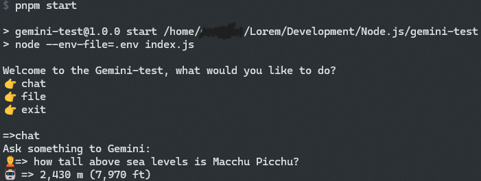
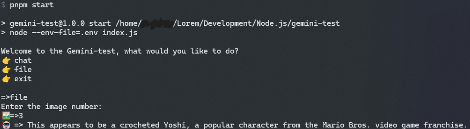

Quick test for Google's Gemini

[Get API Key](https://aistudio.google.com/app/apikey)

## Installation

Use your prefered package manager to install the dependencies (npm, pnpm, yarn, ...)

```bash
pnpm install
```

add your API key to the `.env` file

```bash
GOOGLE_AI_API_KEY=your_api_key
```

## Usage

```bash
pnpm start
```

## Pictures

#### chat


#### file upload


